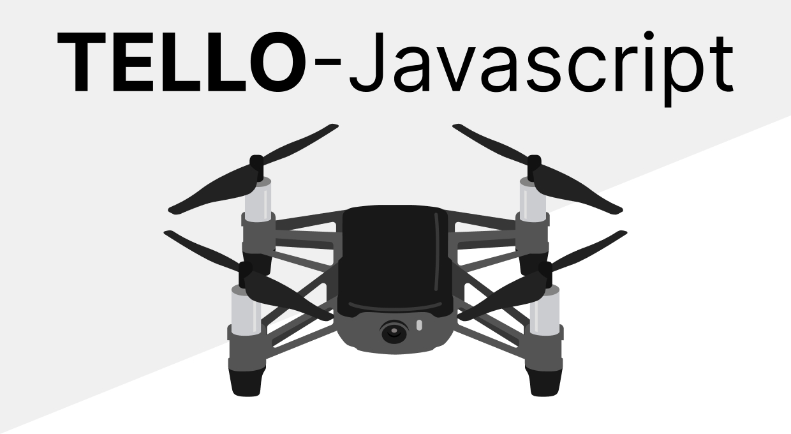

# Tello Javascript

A minimalist Javascript library for programming Tello drones with a WebSocket interface for control, state and videoframes.



**Table of content**
* [How to Install](#how-to-install)
* [How to use](#how-to-use)
* [List of functions](#list-of-functions)
* [IP address and ports config](#ip-address-and-ports-config)
* [WebSocket Server for control](#websocket-server-for-control)
* [Command line interface (CLI)](#command-line-interface)
  * [tello cli tool](#tello-command)
	* [`tello start`](#tello-start)
	* [`tello set-wifi`](#telloset-wifi)
	* [`tello set-ap`](#telloset-ap)
  * [tello-server cli](#tello-server)
* [External Resources](#external-resources)

# How to install

ℹ️  [REQUIREMENT] To use this library you need to install:
- [Node.js](https://nodejs.org/)

## Option 1: install using npm

[Video Demo](https://github.com/harleylara/tello-js/assets/35354399/46b0ccc8-c98a-4667-baf0-3b532d9c6eeb)

1. Open a terminal and run.

```console
$ npm i @harleylara/tello-js -g
```

2. Done

## Option 2: install from source

1. Download/clone this repository on your computer.
```console
$ git clone https://github.com/harleylara/tello-js
```

2. In the **root directory** of **this** project execute.
```console
$ npm install -g .
```

3. Done

At this point you are ready to have fun with your drone using javascript.

# How to use

Basic usage:
```js
const Tello = require('tello.js')

const drone = Tello();

drone.connect(); // without arguments uses default ip and ports
drone.takeoff();
// cool stuff ...
drone.land();
drone.disconnect();
```

# List of functions

- **async** `connect(tello_ip: str, control_port: int, state_port: int, video_port: int)`
- `disconnect()`: Close all connections.
- `getState()` returns the latest state of the drone as a object, check [stateDefinition.json](./src/stateDefinition.json) for more details.
- `initFfmpeg()` harley's note: this should be replaced with a function like `startVideo` that containt `streamon` and `initFfmpeg()`
- `enableStream()` for now is just sending the `streamon` command
- async `sendCmd(command: str)`
- async `wait(time_ms: int)`

# IP address and ports config

In case the drone is not using the default IP address and ports you can change the parameters in the `drone.json` file in the root directory of this repository.


# WebSocket Server for control

In case you want to control the drone using WebSocket you can configure the parameters in the `server.json` file in the root directory of this repository.

ℹ️ By default when the drone is initialized it broadcasts frames in BASE64 format to all clients connected to the default address `ws://localhost:3000`. You can change the address and port with the `drone.json` file in the `"videoServer"` section.

ℹ️ For more details: [WebSocket Server (Control, Set and State)](docs/socket.md)

# Command Line Interface

This package contain two cli tools to manage the tello drone:
- `tello` used launch tello-js and send command over the terminal
- `tello-server` launch tello-js with the websocket interface.

##  `tello` command

To get help on how to use this command:
```console
$ tello help

Usage: tello [options] [command]

CLI to manage Tello drone

Options:
  -V, --version       output the version number
  -h, --help          display help for command

Commands:
  start [options]     Start communication with the tello drone
  set-wifi [options]  Set Tello's WiFi network in station-mode (Tello create a WiFi network)
  set-ap [options]    Switch Tello into Access Point (AP) mode. Tello connect to an external WiFi network
  help [command]      display help for command
```
###  `tello start`

The command `tello start` launch tello-js in interactive mode, this allows you to send ℹ️ **RAW commands** ℹ️ to the drone directly from the terminal (commands from the SDK see [list of commands](./docs/socket.md#list-of-commands))

```console
$ tello start
```

To get documentation about to set flags use the command `help` before `start`

```console
$ tello help start

Usage: tello start [options]

Start communication with the tello drone

Options:
  --drone-ip <address>            tello drone IP address (default: "192.168.10.1")
  --control-port <number>         port to send control commands (default: 8889)
  --state-port <number>           port to get drone internal state (default: 8890)
  --video-port <number>           port to get video frames from drone (default: 11111)
  --video-socket-ip <address>     IP address serving video frames over websocket (default: "0.0.0.0")
  --video-socket-port <number>    port to get video frames over websocket (default: 3001)
  --control-socket-port <number>  port to send control commands over websocket (default: 3000)
  -h, --help                      display help for command
```

E.g. to launch `tello` with an especific IP address:
```sconsoleh
$ tello start --drone-ip 192.168.1.10
```

### `tello set-wifi`

The command `tello set-wifi` helps to setup drone's WiFi network in **station-mode**. ℹ️ Use the `-i` flag to do it interactively, the command terminal will ask for the name you want to give to the network and the password to be set.

```console
$ tello set-wifi -i
```

You can also configure the wifi in non-interactive mode using the appropriate flags.
```console
$ tello set-wifi -s NETWORK_NAME -p 123456789
```

To get documentation about to set flags user the command `help` before `set-wifi`
```console
$ tello help set-wifi

Usage: tello set-wifi [options]

Set Tello's WiFi network in station-mode (Tello create a WiFi network)

Options:
  -s, --ssid <name>      name of the drone's wifi network.
                            A prefix is always added, TELO-<your ssid>
                            Default 'TELLO-WIFI' (default: "WIFI")
  -p, --password <pass>  set password to connect drone's wifi. Default 123456789 (default: "123456789")
  -i, --interactive      set wifi in interactive mode
  -h, --help             display help for command

```

###  `tello set-ap`

The `tello set-ap` command does a similar job to `tello set-ap` but sets the drone's network into `access point mode`.

```console
$ tello set-ap -s TELLO-HOTSPOD -p 123456789
```

To get more informacion:
```console
$ tello help set-ap

Usage: tello set-ap [options]

Switch Tello into Access Point (AP) mode. Tello connect to an external WiFi network

Options:
  -s, --ssid <name>      Access Point name
  -p, --password <pass>  Access Point password
  -i, --interactive      set access-point mode in interactive mode
  -h, --help             display help for command

```

## `tello-server`

# External Resources
- [Tello SDK 2.0 - Official User Guide](https://dl-cdn.ryzerobotics.com/downloads/Tello/Tello%20SDK%202.0%20User%20Guide.pdf)
- [ROBOMASTER TT SDK 3.0 - Official User Guide](https://dl.djicdn.com/downloads/RoboMaster+TT/Tello_SDK_3.0_User_Guide_en.pdf)
- [Tello - User Guide](https://dl.djicdn.com/downloads/RoboMaster+TT/Tello_SDK_3.0_User_Guide_en.pdf)
