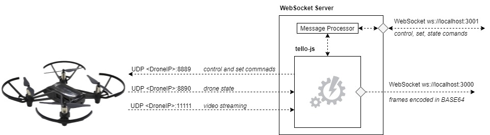

# Communication Model

This library is intended to program the drone using javascript, but it also contains functionalities that expose websockets that allow to control the drone from external clients (for example from the browser).

Due to the nature of the Tello drones that use UDP as communication protocol it is not possible to interact directly from the browser, so the following communication model is used.

